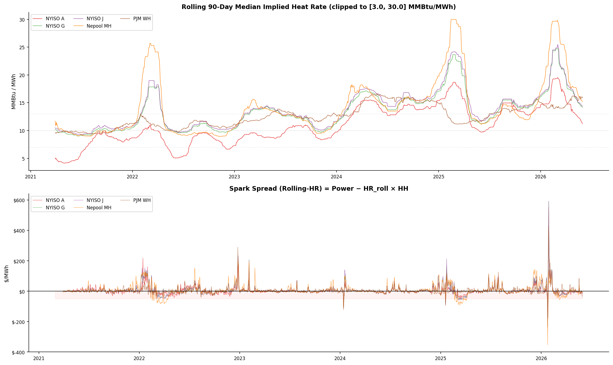

# Energy Hedge Ratio using Copula Models
## Mehrdad Heyrani (https://www.linkedin.com/in/mehrdad-heyrani/)
## Overview
This Google Colab notebook implements a comprehensive Copula Hedge Ratio Framework to determine optimal hedge ratios between power prices and natural gas (Henry Hub). It compares traditional Ordinary Least Squares (OLS) methods with a more sophisticated Copula-GARCH approach, accounting for time-varying rolling heat rates and non-linear dependencies between financial assets. The framework aims to help risk managers understand and quantify spark spread risk and identify optimal hedging strategies to minimize exposure to price fluctuations.

## Data
- **Source**: `EIA Power and Natural Gas price`
- **Content**: Includes Henry Hub natural gas prices and power prices for 10 hubs: ERCOT N, Mid C, Nepool MH, NYISO A/C/G/J, PJM WH, SP15.

## Methodology

### 1. Heat Rate Calculation
- **Implied HR_t**: Power_t / HH_t (MMBtu/MWh) on a daily basis.
- **Rolling HR**: A 90-day trailing median of implied heat rates, clipped between 3 and 30 MMBtu/MWh. This approach is robust to extreme price spikes and accounts for time-varying efficiency.
- **Spark Spread (SS_t)**: Calculated as Power_t − HR_t × HH_t ($/MWh), using the rolling heat rate.

### 2. OLS Hedge Ratios
- **Framework**: Based on Ederington (1979), using the relationship ΔSS_t = α + h* × ΔHH_t + ε_t.
- **Variants**:
  - **Constant HR**: Uses a long-run average heat rate, providing a static benchmark.
  - **Rolling HR**: Incorporates the time-varying rolling heat rate for a more dynamic hedge ratio.
- **Metrics**: Optimal hedge ratio (h*) and hedge effectiveness (HE, R²).

### 3. GARCH Marginals & PIT Transformation
- **Models**: AR(1)-GARCH(1,1)-t models are fitted to Henry Hub level changes and Spark Spread level changes for each power hub.
- **PIT Residuals**: Probability Integral Transform (PIT) residuals are extracted from the GARCH models, transforming them into uniformly distributed variables used for copula fitting.

### 4. Copula Fitting
- **Families**: Bivariate copulas (Gaussian, Student-t, Clayton, Gumbel, Frank, Rotated Gumbel) are fitted to the aligned PIT residuals of Spark Spread and Henry Hub.
- **Selection**: The best-fitting copula for each hub is identified based on the Akaike Information Criterion (AIC).

### 5. Copula-GARCH Optimal Hedge Ratios
- **Simulation**: Monte Carlo simulations (10,000 scenarios) are used to generate correlated future price changes based on the fitted copulas.
- **Revenue Calculation**: Revenue scenarios are generated for a grid of hedge ratios, considering the last observed rolling heat rate.
- **Risk Measures**: Optimal hedge ratios (h*) are determined for various risk objectives:
  - Minimum Variance (MinVar)
  - Maximum Hedge Effectiveness (MaxHE)
  - Minimum Conditional Value at Risk (MinCFaR at 95%)
  - Minimum Conditional Expected Shortfall (MinCCFaR)

## Key Findings

